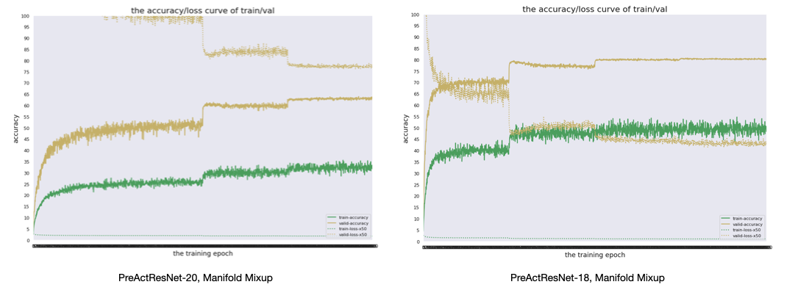

# Image-augmentation
- Reproduce Manifold Mixup(Verma, Vikas, et al.) and AugMix(Hendrycks, Dan, et al.)
- Only CIFAR-100 dataset is supported now.

## How to Run

1. CIFAR-100 with Manifold Mixup

```shell
cd mixup
./run.sh
```

2. CIFAR-100 with AugMix

```shell
cd augmix
./run.sh
```

You can check the summary of model architecture by using `models/summary.py` file.

```shell
cd models
python summary.py
```

## Results



ResNet-18 was not reproduced, so I replaced it with the result of [here](https://github.com/weiaicunzai/pytorch-cifar100#results).

| Model           | Data Augmentation | Epoch | Top-1 Acc |
| --------------- | ----------------- | ----- | --------- |
| ResNet-20       | None              | 240   | 69.95%    |
| PreActResNet-20 | Manifold Mixup    | 2000  | 63.92%    |
| PreActResNet-20 | AugMix            | 200   | 68.41%    |
| ResNet-18       | None              | -     | 75.61%    |
| PreActResNet-18 | Manifold Mixup    | 2000  | 80.72%    |
| PreActResNet-18 | AugMix            | 200   | 75.07%    |

## References

- Manifold Mixup code is based on https://github.com/vikasverma1077/manifold_mixup
- AugMix code is based on  https://github.com/google-research/augmix
- https://github.com/weiaicunzai/pytorch-cifar100#results
